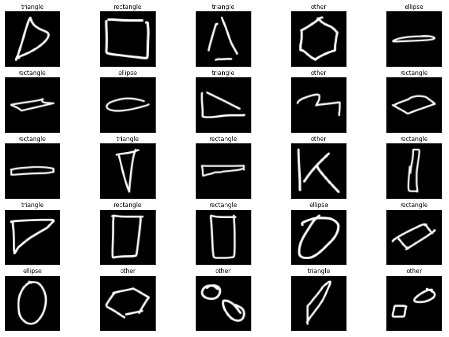
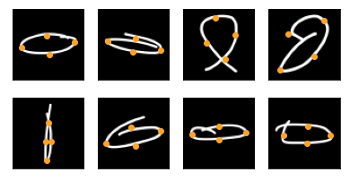

# Hand-drawn Shapes (HDS) Dataset

## Summary
Dataset of Hand-drawn Images of shapes with vertices. 

Table of Contents

* [Directory Structure](#directory-structure)
* [HDS Dataset](#hds-dataset)
* [The Images](#the-images)
* [Processing](#processing)
* [About the Data](#about-the-data)
* [To do](#to-do)
* [Communication](#communication)
* [Licenses](#licenses)

## Directory Structure
- **data**: Contains all the HDS Dataset, with Images and Vertices .
  - 1 directory per user
    - For each sample, there is:
      - A file with an image like: images/ellipse/*ellipse.aly.0001*.png
      - A file with the vertices coordinates, like: vertices/ellipse/*ellipse.aly.0001*.csv
- **processing**: Contains notebooks for ETL and modelisation.
  - **classify**: Classification of shapes.
  - **find_vertices**: Regression to find the vertices.

## HDS Dataset
- a Dataset of hand-drawn Shapes and Vertices for Machine Learning **Classification** and **Regression**.  

I have created this Dataset for my app **[Mix on Pix](https://apps.apple.com/us/app/mix-on-pix-text-on-photos/id633281586)**.

## The Images 
Images exist in 4 shapes:
- Ellipse
- Rectangle
- Triangle
- Other

The Dataset contains images (70px x 70px x 1 gray channel) distributed as:

| Total | Other | Ellipse |  Rectangle | Triangle |
| :---------------:|---------------:|---------------:|---------------:|---------------: |
| **27292** images  |  7287  | 6454 |  6956  | 6595 |

The shapes have been size-normalized and centered in a fixed-size image.
## Processing
### Classification
Hand Drawn Images of shapes are classified to determine the type of each shape.   
More details [here](processing/classify/README.md).
### Regression  
Regression is used to determine the exact **intended size and angle** of each drawn shape.  
The vertices are the oranges points superimposed on the ellipses in the examples below.   

More details [here](processing/find_vertices/README.md).

## About the Data
### People
Images were mostly generated by asking people I knew to draw Ellipses, Rectangles and Triangles in [Mix on Pix](https://apps.apple.com/us/app/mix-on-pix-text-on-photos/id633281586).  
People were aged from 7 to 87. I asked them to draw the way they wanted, slow or fast. In particular, I did not ask to draw nice shape. It was the **intent** while drawing that interested me.
### Tools
- I have created tools within [Mix on Pix](https://apps.apple.com/us/app/mix-on-pix-text-on-photos/id633281586) to generate 70px x 70px png files for each shape drawn.  
- I also created tools in [Mix on Pix](https://apps.apple.com/us/app/mix-on-pix-text-on-photos/id633281586) to position the Vertices.

### Vertices
Coordinates of vertices (like the 4 corners of a rectangle) are interesting as they are much more precise than just a surrending box used in object detection.
Vertices allow to determine the angle of the shape and it exact size.
But labelling is more complicated as explained [here](processing/find_vertices/README.md).

### Direct augmentation of the data. 
  - 3 variations were generated per image
    1. Normal
    2. 1.5 to 3.0 wider
    3. 1.5 to 3.0 narrower
  - One advantage is that I realized that:
    - People tend to make equilibrated shapes (Circle, Square, Equilateral triangle). 
    - Most elongated images were interesting and sometime presented a different challenge than the original. 
  - This processing was not done for type Other.
  - I validated them all manually (or we could say visually) and removed the generated images that were not interesting.
  - This is different than the Augmentation done during Training (like horizontal and vertical flips, rotations) because:
    - It applies to all images including Validation set and Test set.
    - Being generated before being drawn provided images of a better quality.

I then used these images to train models that are used in [Mix on Pix](https://apps.apple.com/us/app/mix-on-pix-text-on-photos/id633281586) Auto-Shapes feature.
### Shape of type Other
The first ML models had no **Other** shape. I was initially happy with the excellent accuracy when the drawing was actually a rectangle, triangle or ellipse. But when testing internally with [Mix on Pix](https://apps.apple.com/us/app/mix-on-pix-text-on-photos/id633281586), drawings of shapes like stars, hearts or crosses would always be recognized as one of Ellipse, Rectangle or Triangle. It is not a great user experience.    

---
## To do
### General
- Explain more about tuning for Hyperparameters and tweaks (like reference for first point for vertices).
- Create a DataSheet for the Dataset as described in https://arxiv.org/pdf/1803.09010.pdf  

### Vertices
- Show video of classification and finding vertices in actions.    

### Later if requested
- Explain pipeline
- Add requirements.txt for Notebooks
- Show model to calculate Vertices for Rectangles and Triangles
---

## Communication

- If you want to contribute, submit a pull request.
- If you found a bug, have suggestions or need help, please, open an issue.

---

## Licenses
- The data: Hand-drawn Shapes (HDS) Dataset © 2022 by Francois Robert is licensed under CC BY 4.0. To view a copy of this license, visit http://creativecommons.org/licenses/by/4.0/.
- The code: The code in the notebooks is licensed under the MIT license. See [here](processing/LICENSE.txt).
---
by Francois Robert 

