# Shape Dataset

Contains
- a Dataset of Shapes for Machine Learning Classification.
- a Notebook to read the images and prepare data (ETL).
- a Notebook to do Shape classification.

I have created this set of data for my app **[Mix on Pix](https://apps.apple.com/us/app/mix-on-pix-text-on-photos/id633281586)**.

The Dataset is in the directory: classify/data

## Images 
Images exist in 4 shapes:
- Ellipse
- Rectangle
- Triangle
- Other

It contains images (70px x 70 px x 1 gray channel) separated in:

| Set | Total | Other | Ellipse |  Rectangle | Triangle |
| :--------------|---------------:|---------------:|---------------:|---------------:|---------------: |
| Training set |  **21393** images  |  5316  | 5025 |  5740  | 5312 |
| Validation set | **3983** images  |  1130  | 1069 |  860  | 924 |
| Test set | **1923** images  |  841  | 360 |  359  | 363 |
  

### Examples
Images from the Training set:
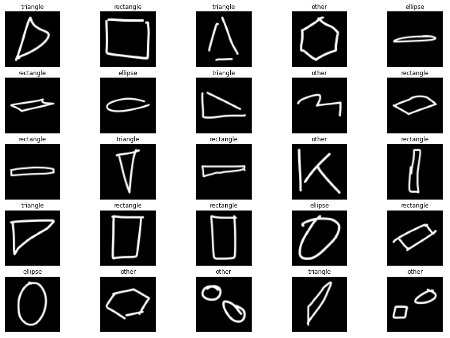

## Data
### People
Images were mostly generated by asking people I knew to draw Ellipses, Rectangles and Triangles in [Mix on Pix](https://apps.apple.com/us/app/mix-on-pix-text-on-photos/id633281586).  
People were aged from 7 to 87. I ask them to draw the way they wanted, slow or fast. In particular, I did not ask to draw nice shape. It was the **intent** while drawing that interested me.
### Tools
I have created tools within [Mix on Pix](https://apps.apple.com/us/app/mix-on-pix-text-on-photos/id633281586) to generate 70px x 70px png files for each shape drawn.  
I then used these images to train a model that is used in [Mix on Pix](https://apps.apple.com/us/app/mix-on-pix-text-on-photos/id633281586) Auto-Shapes feature.
### Shape of type Other
The first ML model had no **Other** shape. I was initially happy with the excellent accuracy when the drawing corresponded to the intent. But when testing internally with [Mix on Pix](https://apps.apple.com/us/app/mix-on-pix-text-on-photos/id633281586), errors while drawing would lead to Ellipse, Rectangle and Triangle recognition. Not a fantastic user experience.    
Moreover, when attacking the more difficult problem of determining the vertices of a shape, the distinction of **Other** shapes became important.

### Difficulty
The difficulty of the classification really depends on the flexibility that we want to implement.  
Let's show some **examples** of various difficulties.
#### Easy
If we force the user to form **very distincts** shapes, the classification is pretty **easy**.  
Ellipse            |  Rectangle | Triangle
:-------------------------:|:-------------------------:|:-------------------------:
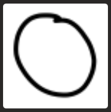  |  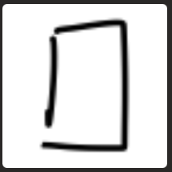  | 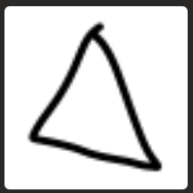 
  
Why is it easy?
- Shapes are pretty much all closed.
- Only the Ellipse contain curves.
- No extra drawing that can confuse the model.
#### Medium
If we consider that the user may be drawing quickly with a basic shape intent but imperfect drawing, it gets more interesting and harder.  
Ellipse            |  Rectangle | Triangle
:-------------------------:|:-------------------------:|:-------------------------:
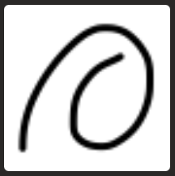  |  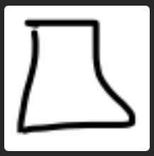  | 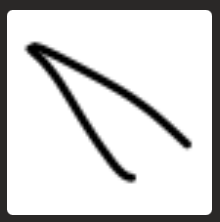 

Why is it more difficult?
- Some open shapes.
- Rectangles and Triangles may contain curves.
- Extra drawing (like in the ellipse). Too much extra drawing will make the shape fall in the **Other** category.

#### Hard
If we try to go to the limit of what a human can interpret, then it becomes much harder and **really interesting**. Here are 2 sets of hard images.   
Ellipse            |  Rectangle | Triangle
:-------------------------:|:-------------------------:|:-------------------------:
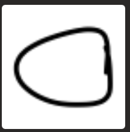  |  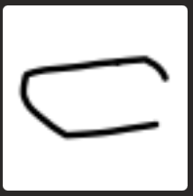  |   

Why is it even more difficult?
- The Ellipses have curves, but can almost be shaped as a Triangle.
- The Triangles can also have curves.
- The Rectangles have some parallel lines, but can contain curves .  

or

Ellipse            |  Rectangle | Triangle
:-------------------------:|:-------------------------:|:-------------------------:
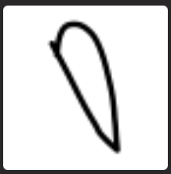  |  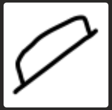  | 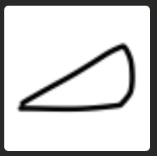  

Why is it even more difficult?  
When **drawing quickly**, the intent may only be roughly expressed in the actual drawing:
- An ellipse may not contains a lot of curves.
- Sides may have different lengths. Still the intent must be considered.
- The intent of a straight line may contain curves. 

## Notes
- When training for [Mix on Pix](https://apps.apple.com/us/app/mix-on-pix-text-on-photos/id633281586) using a GPU over 300 epochs, I get a validation accuracy around 0.9980
- Once the model is trained, I generated a TensorFlow Lite model that I then use in [Mix on Pix](https://apps.apple.com/us/app/mix-on-pix-text-on-photos/id633281586).

## To do
General
- Make a smaller dataset subset?
- Create a DataSheet for the Dataset as described in https://arxiv.org/pdf/1803.09010.pdf  

Classification
- Rename variables like X_train

Later
- Show Saliency map after classification.
- Show model to calculate Vertices

---
by Francois Robert 

