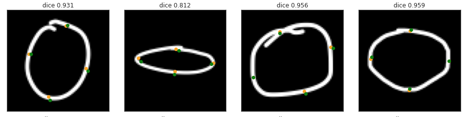

# Shape Dataset

## Summary
Dataset of Hand Drawn Images of shapes. 

## Directory Structure
- **data**: Contains all the Dataset, with Images and Vertices .
  - 1 directory per user
    - For each sample, there is:
      - A file with an image like: images/ellipse/*ellipse.aly.0001*.png
      - A file with the vertices coordinates, like: vertices/ellipse/*ellipse.aly.0001*.csv
- **processing**: Contains notebooks for ETL and modelisation.
  - **classify**: Classification
  - **find_vertices**: Regression

## Dataset
- a Dataset of Shapes and Vertices for Machine Learning **Classification** and **Regression**.  

## Processing
### Classification
Hand Drawn Images of shapes are classified to determine the type of each shape.   
More details [here](processing/classify/README.md).
### Regression  
Regression is done to determine the exact size and angle of each shape.   
For each shape, the vertices of the shape are expressed as x,y coordinates.  
Vertices are the extremities that define the shape.

Notebooks:
  - a Notebook to read the images and Vertices and prepare data (ETL) for Ellipses.

I have created this Dataset for my app **[Mix on Pix](https://apps.apple.com/us/app/mix-on-pix-text-on-photos/id633281586)**.

## The Images 
Images exist in 4 shapes:
- Ellipse
- Rectangle
- Triangle
- Other

The Dataset contains images (70px x 70 px x 1 gray channel) distributed as:

| Total | Other | Ellipse |  Rectangle | Triangle |
| :---------------:|---------------:|---------------:|---------------:|---------------: |
| **27292** images  |  7287  | 6454 |  6956  | 6595 |
  

## The Data
### People
Images were mostly generated by asking people I knew to draw Ellipses, Rectangles and Triangles in [Mix on Pix](https://apps.apple.com/us/app/mix-on-pix-text-on-photos/id633281586).  
People were aged from 7 to 87. I ask them to draw the way they wanted, slow or fast. In particular, I did not ask to draw nice shape. It was the **intent** while drawing that interested me.
### Tools
- I have created tools within [Mix on Pix](https://apps.apple.com/us/app/mix-on-pix-text-on-photos/id633281586) to generate 70px x 70px png files for each shape drawn.  
- I also created tools in Mix on Pix to position the Vertices.

I then used these images to train a model that is used in [Mix on Pix](https://apps.apple.com/us/app/mix-on-pix-text-on-photos/id633281586) Auto-Shapes feature.
### Shape of type Other
The first ML model had no **Other** shape. I was initially happy with the excellent accuracy when the drawing corresponded to the intent. But when testing internally with [Mix on Pix](https://apps.apple.com/us/app/mix-on-pix-text-on-photos/id633281586), errors while drawing would lead to Ellipse, Rectangle and Triangle recognition. Not a fantastic user experience.    
Moreover, when attacking the more difficult problem of determining the vertices of a shape, the distinction of **Other** shapes became important.

---
# Regression - Vertices
The vertices are the oranges points superimposed on the ellipses in the examples below.   
Regression can be used to determine the exact **intended size and angle** of the drawn shape.

## Finding the vertices
- The labeled vertices are the oranges points superimposed on the ellipses in the examples below. 
- The predicted vertices are the green points superimposed on the ellipses in the examples below.

Note: The accuracy of the predictions can be improved by training with more epochs.
- Once the model was trained, I generated a TensorFlow Lite model that I then use in [Mix on Pix](https://apps.apple.com/us/app/mix-on-pix-text-on-photos/id633281586).

---
# To do
General
- Put Readme Regression part in a Readme in dir find_vertices
- Create a Intro/Summary on top with visual explainations
- Specify Licence
- Add requirements.txt
- Create a DataSheet for the Dataset as described in https://arxiv.org/pdf/1803.09010.pdf  
- Make a smaller dataset subset?

Vertices
- Finalize Ellipses
- Show model to calculate Vertices for Rectangles and Triangles?
- Indicate the difficulties
  - Augmentation in general
    - First point in particular
- Show video of classification and finding vertices in actions.    

Pipeline
- Explain

---
by Francois Robert 

