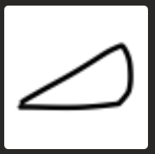

# Classification

Classification of Hand Drawn Images of shapes is done to determine the type of shape. Images exist in 4 shapes:
- Ellipse
- Rectangle
- Triangle
- Other

---

## Notebooks
- a [Notebook](notebooks/a_prepare_data.ipynb) to read the images and prepare data (ETL).
- a [Notebook](notebooks/b_classify_shapes.ipynb) to do Shape classification. 

## Images
Images are (70px x 70 px x 1 gray channel). In the ETL phase, I separated the data in:

| Set | Total | Other | Ellipse |  Rectangle | Triangle |
| :--------------|---------------:|---------------:|---------------:|---------------:|---------------: |
| Training set |  **21386** images  |  5316  | 5025 |  5737  | 5308 |
| Validation set | **3983** images  |  1130  | 1069 |  860  | 924 |
| Test set | **1923** images  |  841  | 360 |  359  | 363 |

---
## Easy to hard
The difficulty of the classification really depends on the flexibility that we want to implement.  
Let's show some **examples** of various difficulties.
### Easy
If we force the user to form **very distincts** shapes, the classification is pretty **easy**.  
Ellipse            |  Rectangle | Triangle
:-------------------------:|:-------------------------:|:-------------------------:
  |    |  
  
Why is it easy?
- Shapes are pretty much all closed.
- Only the Ellipse contain curves.
- No extra drawing that can confuse the model.
### Medium
If we consider that the user may be drawing quickly with a basic shape intent but imperfect drawing, it gets more interesting and harder.  
Ellipse            |  Rectangle | Triangle
:-------------------------:|:-------------------------:|:-------------------------:
  |    |  

Why is it more difficult?
- Some open shapes.
- Rectangles and Triangles may contain curves.
- Some extra drawing is tolerated(like in the ellipse). Too much extra drawing will make the shape fall in the **Other** category.

### Hard
If we try to go to the limit of what a human can interpret, then it becomes much harder and **really interesting**. Here are 2 sets of hard images.   
Ellipse            |  Rectangle | Triangle
:-------------------------:|:-------------------------:|:-------------------------:
  |    |   

Why is it even more difficult?
- The Ellipses have curves, but can almost be shaped as a Triangle.
- The Triangles can also have curves.
- The Rectangles have some parallel lines, but can contain curves .  

or

Ellipse            |  Rectangle | Triangle
:-------------------------:|:-------------------------:|:-------------------------:
  |    |   


Why is it even more difficult?  
When **drawing quickly**, the intent may only be roughly expressed in the actual drawing:
- An ellipse may not contains a lot of curves.
- Sides may have different lengths. We don't expect the user to be precise in it's drawing.

---
## Hyper-parameters
The first considerations that impacts Hyper-parameters is that we can do a lot of very good Data Augmentation on our Training data.
As images can be:
- Flipped horizontally and vertically
- Rotated 360 degres

and still be **as good** as the original images. It is easy to imagine that over, let's say 500 epochs, each image used for training will appear significatively different.

For Classification, we can use Keras ImageDataGenerator to do this Augmentation.

### Learning Rate
I typically run 200 to 300 epochs and only lower the learning rate very slowly due to the big Data Agmentation.   
The correct setting for patience and factor will be important to reach the best accuracy.  
Note the factor of 0.9 and patience of 15. So if there is no improvements in validation accuracy for 15 epochs, I lower the Learning Rate to 90%.
```
learning_rate_reduction = ReduceLROnPlateau(monitor='val_accuracy',
                                            patience=15,
                                            verbose=1,
                                            factor=0.9,
                                            min_lr=0.000000001)
```
---
## Notes on classification
- When doing classification training for [Mix on Pix](https://apps.apple.com/us/app/mix-on-pix-text-on-photos/id633281586) using a GPU over 300 epochs, I get a validation accuracy around 0.9980
- Once the model was trained, I generated a TensorFlow Lite model that I then use in [Mix on Pix](https://apps.apple.com/us/app/mix-on-pix-text-on-photos/id633281586).
---
by Francois Robert 

