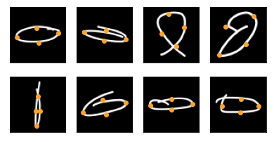
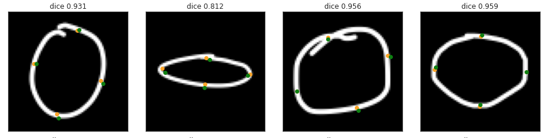
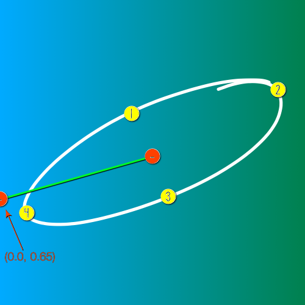
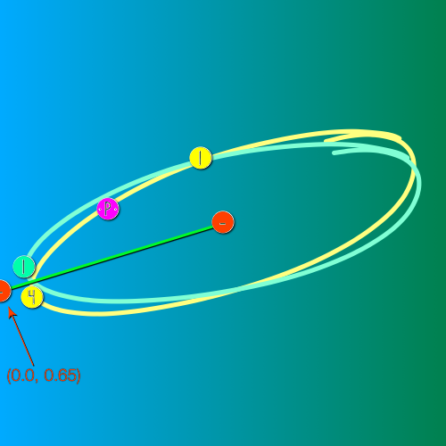

# Regression to find vertices

Regression can be used to determine the exact **intended size and angle** of each drawn shape.

The vertices are the oranges points superimposed on the ellipses in the examples below.   




Vertices are the extremities that define the actual size and angle of a shape.  
For each shape, the vertices of the shape are expressed as x,y coordinates.  


## Finding the vertices
- The labeled vertices are the oranges points superimposed on the ellipses in the examples below. 
- The predicted vertices are the green points superimposed on the ellipses in the examples below.



Note: The accuracy of the predictions can be improved by training with more epochs.
- Once the model was trained, I generated a TensorFlow Lite model that I then ran in [Mix on Pix](https://apps.apple.com/us/app/mix-on-pix-text-on-photos/id633281586) for the Auto-Shapes feature.

---

## Notebooks
- Notebooks for *Extract, transform, load* (ETL) processing 
- Notebooks to estimate the vertices location.

## Images
Images are (70px x 70 px x 1 gray channel). In the ETL phase, I separated the data in:

| Set | Ellipse | rectangle | Triangle |
| :--------------|---------------: |---------------: |---------------: |
| Training set |  4828  | 5386  | 5045  |
| Validation set | 1446  | 1391  | 1370  |
| Test set | 180  | 179  | 180  |

---
## Hyper-parameters
The first considerations that impacts Hyper-parameters is that we can do a lot of very good Data Augmentation on our Training data.
As images can be:
- Flipped horizontally and vertically
- Rotated 360 degres

and still be **as good** as the original images. It is easy to imagine that over, let's say 500 epochs, each image used for training will appear significatively different.

Note: For the Vertices, we **cannot** use Keras ImageDataGenerator to do this Augmentation as we have to **changes our labels** (the vertices coordinates) as we augment each image. I wrote my own generator.

### Learning Rate
I typically run around 1000 epochs and only lower the learning rate very slowly due to the big Data Agmentation.   
The correct setting for patience and factor will be important to reach the best accuracy.  
Note the factor of 0.9 and patience of 25. So if there is no improvements in validation loss for 25 epochs, I lower the Learning Rate to 90%.
```
learning_rate_reduction = ReduceLROnPlateau(monitor='val_loss',
                                            patience=25,
                                            verbose=1,
                                            factor=0.90, 
                                            mode='min',
                                            min_delta=0.0000001,
                                            min_lr=0.000000001)
```
---
## First vertex problematic
One of the difficulties with vertices is to determine **what will be considered the first point (or vertex)**.

### Solution
The solution was to set an anchor point.  
From the way the images were generated, I knew that the shape would be centered.  
The anchor is an arbitrary location from which we can draw a line (called an anchor line) to the center of the image.

From that anchor line, we navigate clockwise until we reach a first point. This point will be considered the first vertex.  
Then we continue clockwise for all vertices.  



I tried various locations for the **anchor**. For the Ellipses, the location **(0.0, 0.65)** seemed to give the best result.
  
### The problem with that solution
When a vertex is very close to the line between the anchor and the center, the training can get confused.  

Let's illustrate that with with 2 similar ellipses, a Turquoise and a Yellow. 




In a clockwise navigation:
- If a point is right after the anchor line, it will be set like Point 1 in Turquoise
- If a point is right before the anchor line, it will be set like Point 4 in Yellow as the Point 1 will have been found about 90 degres of the anchor line.

The net result is that over a lot of this kind of samples, the model will end up averaging between the Point 1 in Turquoise and the Point 1 in Yellow, resulting in a Point P1 in Magenta, which is bad.

### TODO:
- Indicates possibles solutions

---
by Francois Robert 

